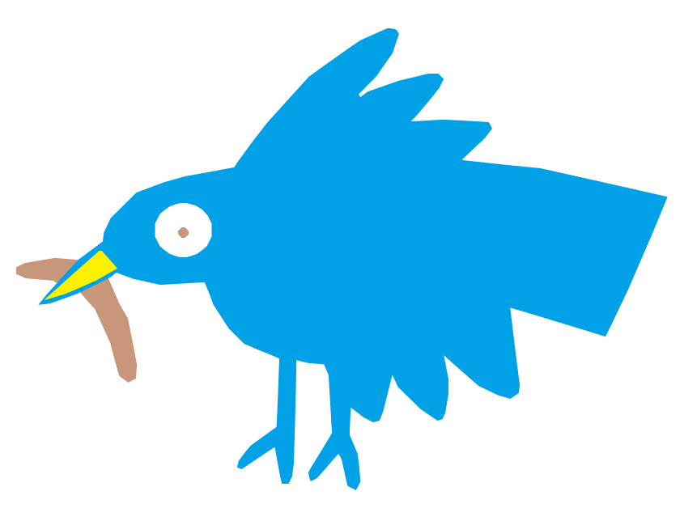
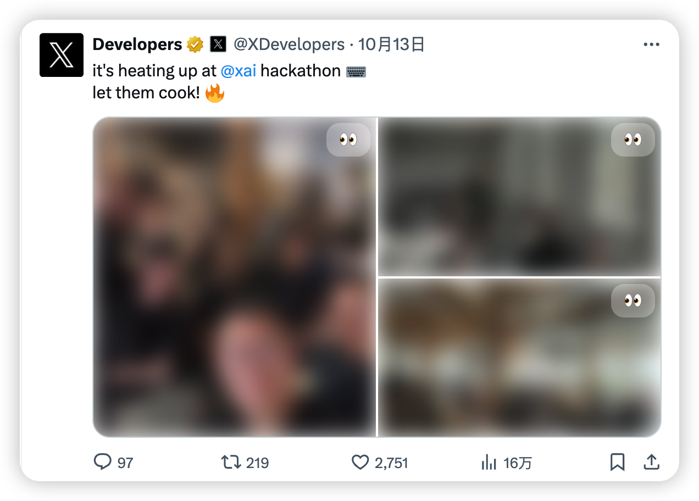

  

用于浏览推特时，模糊媒体资源。专注于信息获取，减少视觉干扰，避免在公共场合出现尴尬的场景，同时在泛滥的互联网噪音中夺取注意力阵地。

  
  

### 开发参考

- [Chrome 插件开发全攻略](https://github.com/sxei/chrome-plugin-demo)

- [下一代浏览器插件开发框架 WXT 入门指南](https://juejin.cn/post/7329724409429917705)
