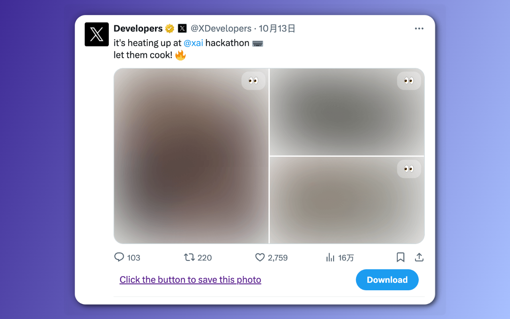
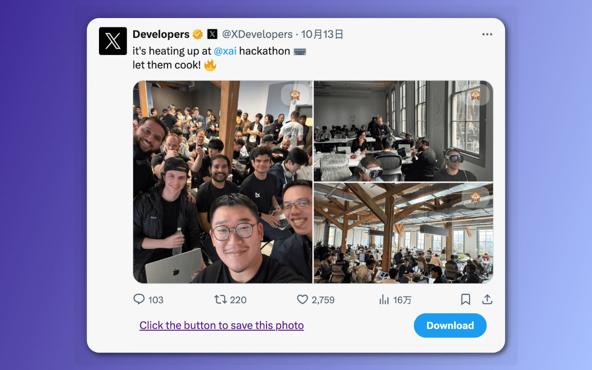

# X-Comfort-Browser

[在谷歌安装](https://chromewebstore.google.com/detail/x-comfort-browse/okfbbbhfbomoeobfifgjnclkdhknccgn)
[在火狐安装](https://addons.mozilla.org/zh-CN/firefox/addon/x-comfort-browser/)

&emsp;&emsp;信息成瘾和注意力的夺取，在互联网上，平台和用户之间互相形成了彼此同构的势力：
平台通过设计产品的细节给用户以信息反馈（如小红点，精准的内容推荐）使用户养成对这种反馈机制的习惯，来保持用户的活跃度；
从用户角度，为了更多的流量的媒体和帐号，在发布的内容中精心的挑选和设计，穿插一些可能无关联甚至吸引性的图片。
图片的滥用和视频的干扰，形成了一种噪音，使得纯文字的阅读能力和信息的表达深度在这视觉的转移运动中逐渐削弱。

&emsp;&emsp;如何获取更多的注意力主动权，保护自己的时间和行为价值，就像做眼保健操一样，是在“课前”需要逐渐的养成良好习惯，也是这个工具的出发所在。

&emsp;&emsp;另外推特这样的内容开放的平台，在公共场合浏览时，有可能跳出一两条不合时宜的图片，让自己老脸一红或措手不及，如何舒适的摸鱼是该工具的另一作用。

  
  

## 目前支持

- [x] 推特
  - 媒体资源模糊
- [x] 知乎
  - 媒体资源模糊
  - 广告移除

## 相关链接

- [Google Extension](https://chromewebstore.google.com/detail/x-comfort-browse/okfbbbhfbomoeobfifgjnclkdhknccgn)

- [Firefox ADD-ONS](https://addons.mozilla.org/zh-CN/firefox/addon/x-comfort-browser/)

- [为革命保护“视”力 - 项目介绍](https://dnevend.site/blog/attention-and-extension)

---

欢迎提体验并提出建议！
